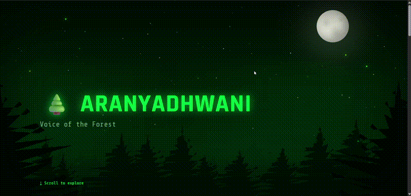
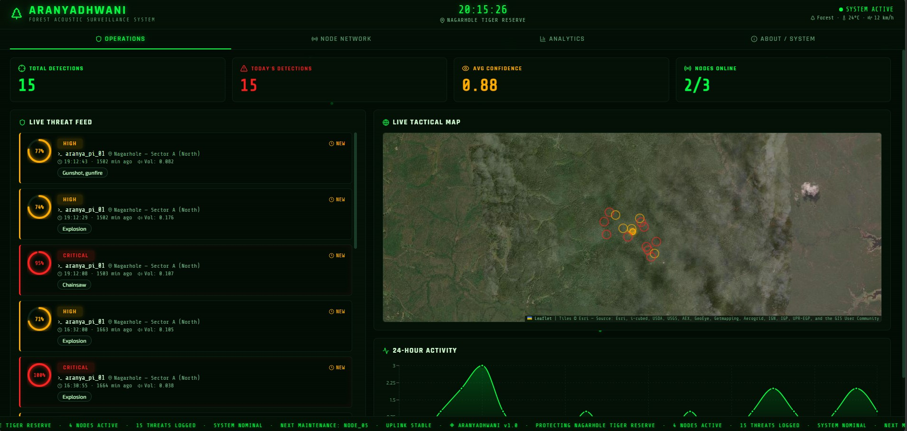

<div align="center">
```
<pre>
   █████╗ ██████╗  █████╗ ███╗   ██╗██╗   ██╗ █████╗ ██████╗ ██╗  ██╗██╗    ██╗ █████╗ ███╗   ██╗██╗
  ██╔══██╗██╔══██╗██╔══██╗████╗  ██║╚██╗ ██╔╝██╔══██╗██╔══██╗██║  ██║██║    ██║██╔══██╗████╗  ██║██║
  ███████║██████╔╝███████║██╔██╗ ██║ ╚████╔╝ ███████║██║  ██║███████║██║ █╗ ██║███████║██╔██╗ ██║██║
  ██╔══██║██╔══██╗██╔══██║██║╚██╗██║  ╚██╔╝  ██╔══██║██║  ██║██╔══██║██║███╗██║██╔══██║██║╚██╗██║██║
  ██║  ██║██║  ██║██║  ██║██║ ╚████║   ██║   ██║  ██║██████╔╝██║  ██║╚███╔███╔╝██║  ██║██║ ╚████║██║
  ╚═╝  ╚═╝╚═╝  ╚═╝╚═╝  ╚═╝╚═╝  ╚═══╝   ╚═╝   ╚═╝  ╚═╝╚═════╝ ╚═╝  ╚═╝ ╚══╝╚══╝ ╚═╝  ╚═╝╚═╝  ╚═══╝╚═╝
</pre>
```


*Landing Page Demo*


### *आरण्यध्वनि — Voice of the Forest*

> **"A chainsaw takes 8 minutes to fell a 100-year-old tree.**  
> **Our AI hears it in the first second."**

*The forest has always spoken. We finally learned to listen.*

**Edge-AI Acoustic Guardian · Real-Time Forest Threat Detection**  
`Raspberry Pi Zero 2 W` · `YAMNet TFLite` · `scipy sosfilt` · `Firebase` · `Twilio`

---

| ⚡ < 3s alert latency | 🧠 521 sound classes | 💰 $15 hardware | 🔇 0 bytes audio sent to cloud |
|---|---|---|---|

</div>


<div align="center">


> *"By the time a satellite sees deforestation, the trees are already gone and the poachers have left.  
> Aranyadhwani hears it while it's happening."*

<br/>

<!-- Replace with actual dashboard screenshot -->


*Live dashboard showing real-time detections from aranya_pi_01 at Nagarhole Tiger Reserve*

</div>

---

## 📖 The Problem

India loses **1.5 million hectares** of forest annually to illegal logging and poaching. The two dominant monitoring approaches both fail at the moment of truth:

| Method | Latency | Coverage | Cost |
|---|---|---|---|
| Satellite imaging | Hours to days | Good, weather-dependent | Very high |
| Drone patrols | Minutes (when airborne) | Small radius, gaps | ₹30,000+/day |
| **Aranyadhwani** | **< 3 seconds** | **400–500m radius, 24/7** | **₹3,750 one-time** |

The chainsaw has been running for 20 minutes by the time a satellite pass captures it. The drone isn't scheduled until Thursday. **Aranyadhwani hears it in the first second.**

---

## 🚀 What Makes This Different

This is not a microphone connected to a cloud API. The entire intelligence stack runs **inside the device**, inside the forest, with no internet dependency for inference.

```
Raw audio → DSP → Neural Network → Spectral Verification → Alert
     ↑                                                        ↓
ReSpeaker HAT                                    Firebase + SMS + WAV
     All of this runs on a $15 Raspberry Pi Zero 2 W
```

### The technical flex

- **521-class audio classification** running at **5 inferences/second** on a quad-core ARM Cortex-A53 with no GPU
- **< 200 MB RAM** total system footprint — confirmed via `htop` in production
- **~0.05 ms** per bandpass filter call (scipy SOS vs 6 ms for equivalent Python loop — **120× faster**)
- **Dual verification** — neural network + independent physical acoustic fingerprint must both agree
- **Zero audio transmitted to cloud** — only a 200-byte JSON document per alert

---

## ⚙️ System Architecture

### Signal Pipeline (every 25 ms)

```
┌─────────────────────────────────────────────────────────────────────┐
│                     Raspberry Pi Zero 2 W                           │
│                                                                     │
│  ReSpeaker HAT          IIR Bandpass         Dual Buffer           │
│  2-mic stereo    ──→    80–7999 Hz    ──→    raw  │ filtered       │
│  16 kHz stereo          scipy sosfilt        WAV  │ AI input       │
│                         zi persists                │                │
│                                                    ↓                │
│                              ┌─────────────────────────────┐        │
│                              │     YAMNet TFLite           │        │
│                              │  521 classes, top-10 check  │        │
│                              │  Family expansion (aliases) │        │
│                              │  O(1) hash map lookup       │        │
│                              └─────────────┬───────────────┘        │
│                                           ↓                         │
│                              ┌─────────────────────────────┐        │
│                              │   Spectral Fingerprint      │        │
│                              │   ZCR + HF energy ratio     │        │
│                              │   +15% confidence on match  │        │
│                              └─────────────┬───────────────┘        │
│                                           ↓                         │
│              ┌──────────────────────────────────────────┐           │
│              │         Dual-Path Router                 │           │
│              │  Local monitor   │   Cloud Firewall      │           │
│              │  18 classes      │   7 classes, >65%     │           │
│              │  Terminal log    │   Firebase + SMS + WAV │           │
│              └──────────────────────────────────────────┘           │
└─────────────────────────────────────────────────────────────────────┘
```

### Multi-Node Mesh Consensus

```
Pi 01 ──detects──→ Firebase detections collection ←──detects── Pi 02
         ↑                       ↓                                ↑
         └────── on_snapshot ────┘────── on_snapshot ────────────┘
                                 ↓
                    MeshConsensusEngine (all nodes)
                    "2 nodes heard Gunshot in 30s"
                                 ↓
                    mesh_events collection ──→ Ranger dashboard
```

No direct Pi-to-Pi networking. Firebase is the message bus. Add a second Pi — mesh activates automatically with zero code changes.

---

## 🔬 Core Technical Concepts

### 1. IIR Biquad Bandpass Filter (scipy sosfilt)

A 2nd-order Butterworth bandpass in SOS (Second-Order Sections) format. SOS avoids the numerical precision problems of standard `b,a` coefficients when cascading stages.

```python
sos_bandpass = signal.butter(N=2, Wn=[80.0, 7999.0],
                              btype='bandpass', fs=16000, output='sos')
```

Critical implementation detail: `filter_zi` (filter state) persists across every 25ms chunk. Without this, each chunk starts cold and produces a brief transient at the boundary. With it, the filter behaves as a true continuous-time system.

```python
filtered_chunk, filter_zi = signal.sosfilt(sos_bandpass, audio_chunk, zi=filter_zi)
```

**Result:** 80–7999 Hz passband, AC hum eliminated, YAMNet gets clean input every time.

### 2. Spectral Fingerprinting — Physical Acoustic Verification

Two independent acoustic signatures computed per detection window:

**Zero-Crossing Rate (ZCR)** — How often the waveform crosses zero per sample.
```python
zcr = float(np.mean(np.abs(np.diff(np.sign(audio)))) / 2.0)
```

**High-Frequency Energy Ratio** — Fraction of total signal energy above 4 kHz.
```python
spectrum = np.abs(np.fft.rfft(audio)) ** 2
hf_ratio = np.sum(spectrum[freqs >= 4000.0]) / (np.sum(spectrum) + 1e-10)
```

Why this works:

| Threat | ZCR | HF Energy | Physics |
|---|---|---|---|
| Chainsaw | 0.15 – 0.45 | > 30% | Continuous buzz, blade harmonics above 4 kHz |
| Gunshot | 0.00 – 0.08 | ~0% | Single pressure transient, energy in low-mid band |
| False positive (thunder) | 0.05 – 0.15 | < 5% | Fails chainsaw fingerprint → no boost |

### 3. Multi-Label Top-10 Detection + Family Expansion

`np.argmax` returns only rank 1. If "Explosion" scores 0.41 and "Gunshot, gunfire" scores 0.38, argmax silently discards the gunshot. Top-10 catches both.

Family expansion handles YAMNet aliases — if "Mechanical sound" appears in top-10, we directly look up its children ("Chainsaw", "Power tool", "Sawing") in the score vector:

```python
THREAT_FAMILY_PARENTS = {
    'Mechanical sound': ['Chainsaw', 'Power tool', 'Sawing'],
    'Loud bang':        ['Gunshot, gunfire', 'Explosion', 'Burst, pop'],
}
```

O(1) lookup via pre-built hash map — no 521-item linear scan during the hot inference loop:
```python
class_index: dict[str, int] = {name: i for i, name in enumerate(class_names)}
c_idx = class_index.get(child)  # O(1) vs O(N) list.index()
```

### 4. Firestore Type Sanitizer

NumPy scalars (`np.bool_`, `np.float32`, `np.int64`) are incompatible with the Firestore Protobuf serializer. `to_python()` walks the entire alert dict recursively before it touches the SDK:

```python
def to_python(obj):
    if isinstance(obj, np.bool_):    return bool(obj)
    if isinstance(obj, np.integer):  return int(obj)
    if isinstance(obj, np.floating): return float(obj)
    if isinstance(obj, dict):        return {k: to_python(v) for k, v in obj.items()}
    return obj
```

### 5. Adaptive Cooldown by Severity

Fixed cooldowns create a dangerous blind spot — a poacher's second shot 45 seconds after the first gets silently suppressed. Adaptive cooldown scales with confidence:

```python
COOLDOWN_BY_SEVERITY = {
    'CRITICAL': 30,   # ≥ 85% — short window, don't miss a second shot
    'HIGH':     60,   # ≥ 70%
    'MEDIUM':   90,   # ≥ 65% — longer window reduces spam
}
```

---

## 🛠️ Hardware Bill of Materials

| Component | Purpose | Cost |
|---|---|---|
| Raspberry Pi Zero 2 W | Quad-core ARM Cortex-A53 compute | ~$15 (~₹1,250) |
| ReSpeaker 2-Mic Pi HAT | I2S stereo microphone array | ~$20 (~₹1,650) |
| Power bank / misc | Field power simulation | ~$10 (~₹850) |
| **Total prototype** | | **~$45 (~₹3,750)** |

**Production node (Phase 2):**

| Component | Upgrade | Cost |
|---|---|---|
| Custom ARM CM4 PCB | Integrated compute + radio | ~$20 |
| Dual MEMS mics (PTFE vents) | Waterproof acoustic input | ~$8 |
| SX1262 LoRa radio | 5–10km forest mesh, no cell towers | ~$8 |
| 5W solar + LiPo | Indefinite autonomous power | ~$20 |
| IP67 enclosure | Weatherproof camouflaged casing | ~$4 |
| **Total production** | | **< $60 (~₹5,000)** |

---

## 📦 Installation

### 1. Clone the repository

```bash
git clone https://github.com/Dhiveej/Aranyadhwani.git
cd Aranyadhwani
```

### 2. Create virtual environment

```bash
python -m venv aranya_env
source aranya_env/bin/activate
```

### 3. Install dependencies

```bash
pip install numpy scipy pyaudio firebase-admin ai-edge-litert twilio
```

### 4. Add your credentials

Place these four files in the project root:

```
Aranyadhwani/
├── listen.py
├── yamnet.tflite
├── yamnet_class_map.csv
└── serviceAccountKey.json     ← Firebase service account (keep secret)
```

### 5. Configure device identity

Open `listen.py` and set your node ID:

```python
DEVICE_ID = 'aranya_pi_01'    # Change per node: _01, _02, _03 ...
```

Set your Twilio credentials for SMS alerts:

```python
TWILIO_ACCOUNT_SID = 'ACxxxxxxxxxxxxxxxxxxxxxxxxxxxxxxxx'
TWILIO_AUTH_TOKEN  = 'xxxxxxxxxxxxxxxxxxxxxxxxxxxxxxxx'
TWILIO_FROM        = '+1xxxxxxxxxx'        # Your Twilio number
TWILIO_TO          = '+91xxxxxxxxxx'       # Ranger's number
```

### 6. Run

```bash
python listen.py
```

**Keep it running after SSH disconnect:**

```bash
nohup python listen.py > aranya.log 2>&1 &
tail -f aranya.log
```

---

## 🌐 Multi-Node Mesh Deployment

Deploy the same `listen.py` on each Pi. Change only one line per device:

```bash
# On Pi 02
sed -i "s/aranya_pi_01/aranya_pi_02/" listen.py
python listen.py
```

All nodes share the same Firebase project. The mesh consensus engine activates automatically — no configuration changes needed. When 2+ nodes report the same threat within 30 seconds, a `mesh_events` document is written with the corroborated alert.

**Coverage planning:**

| Reserve size | Nodes needed | Deployment cost |
|---|---|---|
| 10 sq km | 20–25 nodes | ~₹1.25 lakh |
| 100 sq km | 200–250 nodes | ~₹12.5 lakh |
| 1000 sq km | 2000–2500 nodes | ~₹1.25 crore |

---

## 🗄️ Firebase Collections

| Collection | Written by | Purpose |
|---|---|---|
| `detections` | Each Pi independently | Raw per-node alert feed |
| `mesh_events` | Consensus engine | Corroborated multi-node alerts |
| `devices` | Each Pi (heartbeat) | Node health, last-seen timestamp |

Each detection document contains:

```json
{
  "device_id": "aranya_pi_01",
  "threat": "Gunshot, gunfire",
  "confidence": 93.4,
  "severity": "CRITICAL",
  "rms_loudness": 0.0821,
  "spectral_match": true,
  "zcr": 0.031,
  "hf_energy_ratio": 0.018,
  "evidence_file": "threat_evidence/20260318_122231_Gunshot__gunfire_93.wav",
  "status": "NEW",
  "timestamp": "2026-03-18T12:22:31Z"
}
```

---

## 🛣️ Production Roadmap

### Phase 2 — Hardware Evolution

**Microcontroller swap:** Transition from Pi Zero 2W to **ESP32-S3** (8MB PSRAM) running C++ and TensorFlow Lite for Microcontrollers. Power draw drops from ~1W to **< 100mW** — a 10× improvement that enables smaller solar panels and longer battery life.

**Model distillation:** Compress the 521-class YAMNet (~3.5MB) into a hyper-specific quantized Edge Impulse model (~150KB) trained only on target threat classes. Inference latency drops from 200ms to ~20ms.

### Phase 3 — Network Architecture

**Two-tier LoRaWAN mesh:** Tree nodes use SX1262 LoRa radios (sub-GHz) to bounce telemetry through dense forest canopy to a gateway node. Gateway connects via NB-IoT or Swarm satellite backhaul. No cell towers. No Wi-Fi. Works 200km from the nearest road.

**Acoustic triangulation (TDoA):** Time Difference of Arrival across 3+ synchronized nodes. The speed of sound is 343 m/s. A gunshot reaches Node 01 at t=0, Node 02 at t=0.23s, Node 03 at t=0.41s. Solving the hyperbolic intersection gives GPS coordinates of the shooter. Rangers get a map pin, not just a sector name.

### Phase 4 — Intelligence Layer

**Confidence trend tracking:** Alert only if the same class scores above threshold in 3 consecutive 200ms windows. Eliminates single-frame false positives from door slams or backfires.

**Firebase Storage audio upload:** Evidence WAVs uploaded to cloud storage. Rangers listen to what triggered the alert from their phone before deciding whether to deploy.

**Species population monitoring:** In non-threat mode, log tiger roars, elephant trumpets, and bird calls to build animal movement datasets over time. Conservation science as a byproduct of the security system.

---

## 📊 Performance Benchmarks

Measured on Raspberry Pi Zero 2 W in production:

| Metric | Value |
|---|---|
| Inference rate | 5 Hz (every 200ms) |
| Bandpass filter latency | ~0.05 ms per call |
| End-to-end alert latency | < 3 seconds (detection → SMS) |
| RAM footprint | < 200 MB |
| Threat classes monitored | 18 (local) / 7 (cloud) |
| False positive rate (demo mode) | Negligible with spectral fingerprint |
| Evidence WAV quality | 16 kHz mono, lossless PCM |

---

## 📁 Repository Structure

```
Aranyadhwani/
├── listen.py                    # Main detection script (v5.1)
├── yamnet.tflite                # YAMNet model (TFLite, ~3.5MB)
├── yamnet_class_map.csv         # 521-class label map
├── serviceAccountKey.json       # Firebase credentials (gitignored)
├── threat_evidence/             # Local WAV evidence store
│   └── YYYYMMDD_HHMMSS_Threat_confidence.wav
├── requirements.txt
└── README.md
```

---

## 🔒 Security Notes

- `serviceAccountKey.json` is **never committed** — add it to `.gitignore`
- Twilio credentials are stored in `listen.py` config section — use environment variables in production
- No raw audio is ever transmitted to Firebase — only metadata
- All Firestore writes use the Admin SDK with service account authentication

---

## 👥 Team — The Canopy Collection

| Name | Role |
|---|---|
| Dhiveej Atish N | Project Lead, AI/DSP Architecture |
| Amogh A Devadiga | Firmware & Signal Processing |
| Akshay D Shetty | Cloud Infrastructure & Firebase |
| E J Charan | Hardware Integration |
| B Madan | Systems Integration & Testing |
| Bhumika Bindagi | Research & Documentation |

Department of Computer Science and Engineering 
RNS Institute of Technology, Bengaluru  

---

## 📄 Research Foundation

**Base Model:** YAMNet — trained on AudioSet  
**Reference:** Gemmeke et al., *"AudioSet: An ontology and human-labeled dataset for audio events"*, Google Research, ICASSP 2017

YAMNet's 521-class ontology covers the complete acoustic space from mechanical tools to wildlife calls, making it uniquely suited for forest threat detection without any fine-tuning on proprietary datasets.

---

## 📜 License

MIT License — see [LICENSE](LICENSE)

---

<div align="center">

*"Aranyadhwani is more than an acoustic sensor — it is a scalable, active defense network.  
We have proven that state-of-the-art AI can run sustainably at the absolute edge,  
turning every tree into a guardian for our most vulnerable ecosystems."*

**🌲 Built for the forests. Deployed at the edge. Alerts in seconds. 🌲**

</div>
